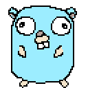

# jogo-da-live

Este é o nosso primeiro projeto na Codigolândia: um jogo desenvolvido em **Go**
e que pode ser jogado durante as lives!

Neste jogo cada participante terá seu avatar exibido como um **overlay** sobre
a live, e as interações no chat poderão ser utilizadas para movimentar o seu
personagem, atacar outros jogadores e muito mais!

Poderemos também adicionar as mensagens do chat nesta implementação e também
recursos exclusivos para membros/apoiadores do canal.

## Ferramentas utilizadas

* Vim (raiz!) para a edição do código, com auxílio do plugin `vim-go` e algumas
  outras configurações.
* Ebitengine como motor de jogo simples em Go.
* Biblioteca do Youtube para Go para obter as interações do chat.

## Como funciona?

O programa em `cmd/jogo-da-live` irá desenhar uma janela com um fundo verde,
que é adicionada ao OBS e possui o filtro de *chroma key* aplicado.

Este programa se conecta aos chats da transmissão ao vivo e utiliza esta
informação para desenhar os personagens
na tela.

## TODO

- [x] Ler os inscritos do Youtube
- [x] Ler os inscritos do Twitch
- [x] Não duplicar os inscritos
- [x] Criar um pixel art do Gopher
- [ ] Movimentar o inscrito na tela
- [ ] Adicionar os comandos de chat

## Referências

1. API do Youtube para transmissão ao vivo: https://developers.google.com/youtube/v3/live/docs
2. API da Twitch para desenvolver um chat bot: https://dev.twitch.tv/docs/irc/
3. Documentação do Ebitengine: https://ebitengine.org/
